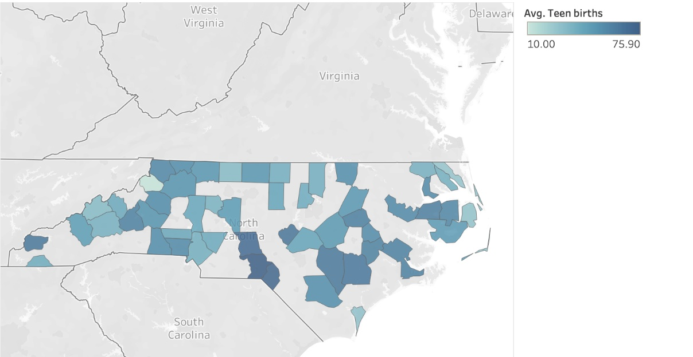

# ENGL105-Unit3
This is a repository containing instructional materials and sample data sets for Prof. Gotzler's fall sections of ENGL105 at the University of North Carolina at Chapel Hill.

The repository contains two CSV files that contain the original data and its coinciding subset. These datasets are contained in the data file, along with the Markdown instructions/actual program used to create the new subset.

The data comes from the UNC Davis Library public repository, --. 

### The Purpose
The NC_subset data we created can be used to identify the various health conditions across the state of North Carolina. Specifically, locating the number of teen births and visualizing trends throughout the state that can be seen in the data. 

### Potential 
This repository was created to assist the public in creating a subset from a large data set, specifically breaking down the public health data found in UNC Davis Library's public repository. This data can be useful for hospital workers and social workers because their jobs are directly related to teen births and they witness the effects throughout the community. 

