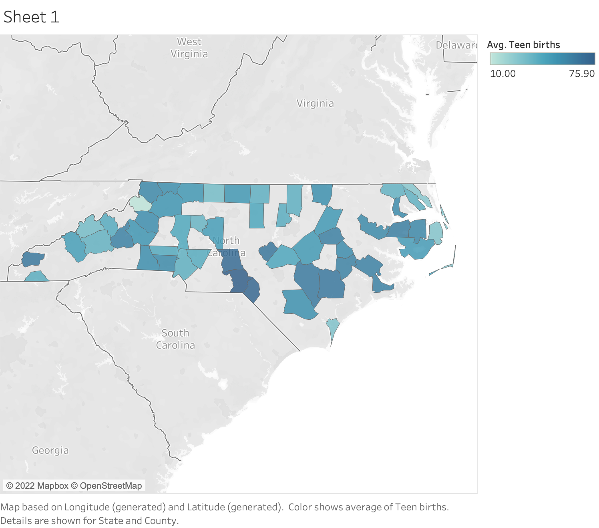

# ENGL105-Unit3
This is a repository containing instructional materials and sample data sets for Prof. Gotzler's fall sections of ENGL105 at the University of North Carolina at Chapel Hill.

The repository contains two CSV files that contain the original data and its coinciding subset. These datasets are contained in the data file, along with the Markdown instructions/actual program used to create the new subset.

The data comes from the UNC Davis Library public repository, --. 

### The Purpose
The NC_subset data we created can be used to identify the number of teen births across the state, specifically to analyze specific trends in this data. 

### Potential 
This data can be useful for hospital workers, --, and -- because they have an impact on teen births and witness the effects throughout the community. 
Potential (WHY was the repo created and what might people do with it) 

